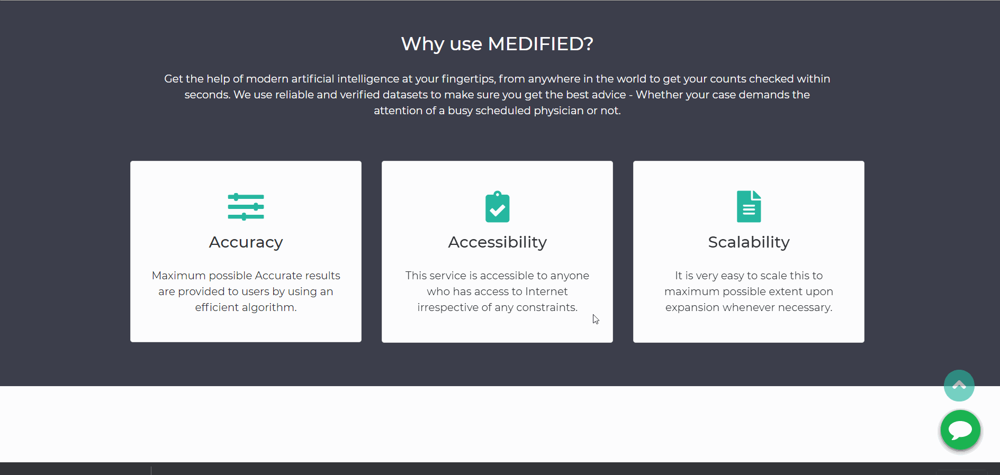

# Medified

# Medified-Health-Assistant
Medified is an instant medical checkup service. It will predict the chances of getting disease to the patient by collecting patients health conditions as input.Using machine learning we built models for some diseases to predict health condition of the patient through a series of inputs from the patient.

*You can check the demo of the project by [clicking here](https://yoonus47.github.io/Medified/)*

# Key Features
1) Nice UI to make user-friendly.
2) Can access at any time anywhere.
3) Chatbot service.
4) The user will get a Medical Report after the checkup.

# Dataset used
1) [Breast Cancer](https://www.kaggle.com/uciml/breast-cancer-wisconsin-data): Winconsin Breast Cancer Dataset

2) [Diabetes](https://www.kaggle.com/uciml/pima-indians-diabetes-database): Pima Indian Diabetes Dataset

3) [Heart](https://www.kaggle.com/ronitf/heart-disease-uci): Heart Disease Dataset

4) [Kidney](https://www.kaggle.com/mansoordaku/ckdisease): Chronic Kidney Disease Dataset

# Libraries & Technologies stacks Used:
1)Sci-kit Learn

2)Python Flask

3)Joblib

4)Pandas

5)Numpy

6)HTML, CSS & Bootstrap

# Steps used for Deployment:
1) Created the ML models and saved it using joblib.

2) Created backend using python flask.

3) Created UI for main page and pages it will redirect to.

5) Created a chatbot using  [Dialogeflow](https://dialogflow.cloud.google.com/) and deployed it using [kommunitcate](https://www.kommunicate.io/product/dialogflow-integration)

5) Deployed all ML models in Heroku and Hosted the website in Github pages.

# Project Created by:
  [Abdul Adhil PK](https://github.com/adhilcodes.me)        
  
  [Muhammed Yoonus](https://github.com/yoonus47/Medified/)
  
  [Muhammed Hashir PM](https://github.com/hashirpm.github.io/)
 

